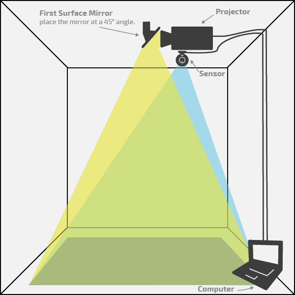
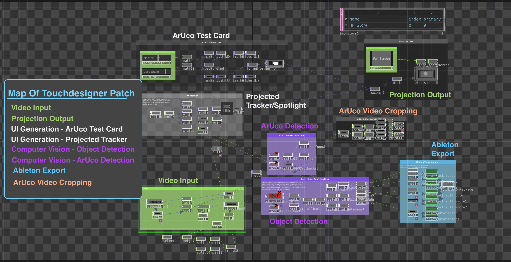
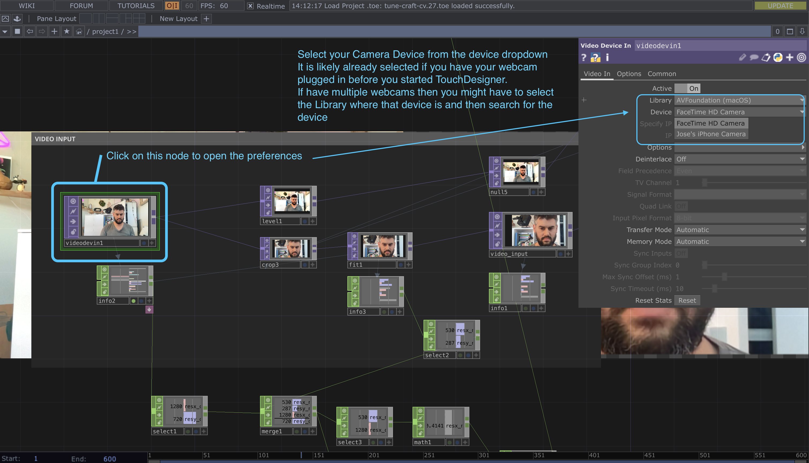
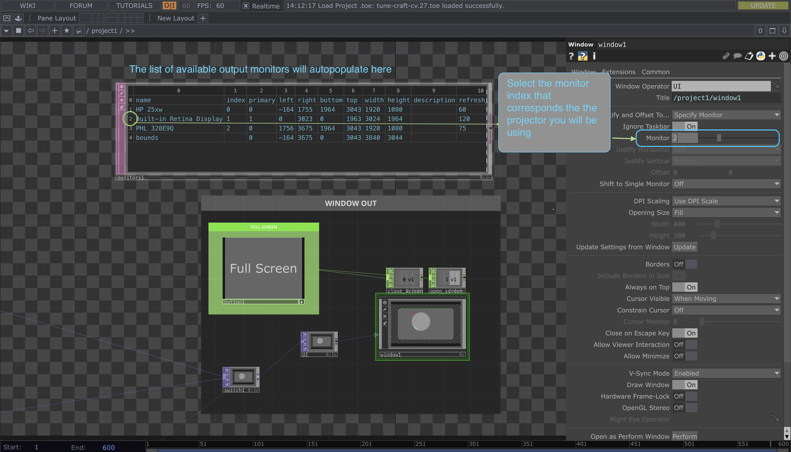
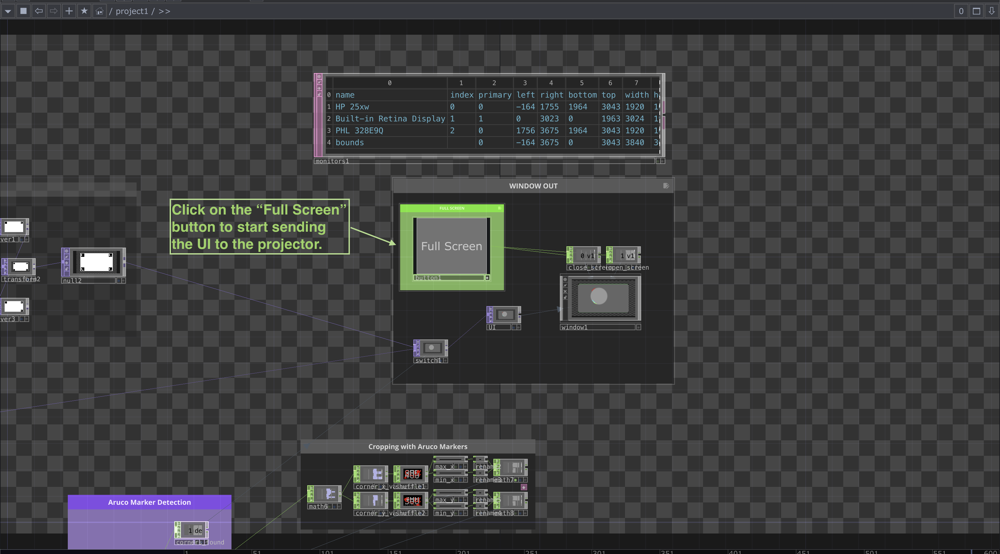
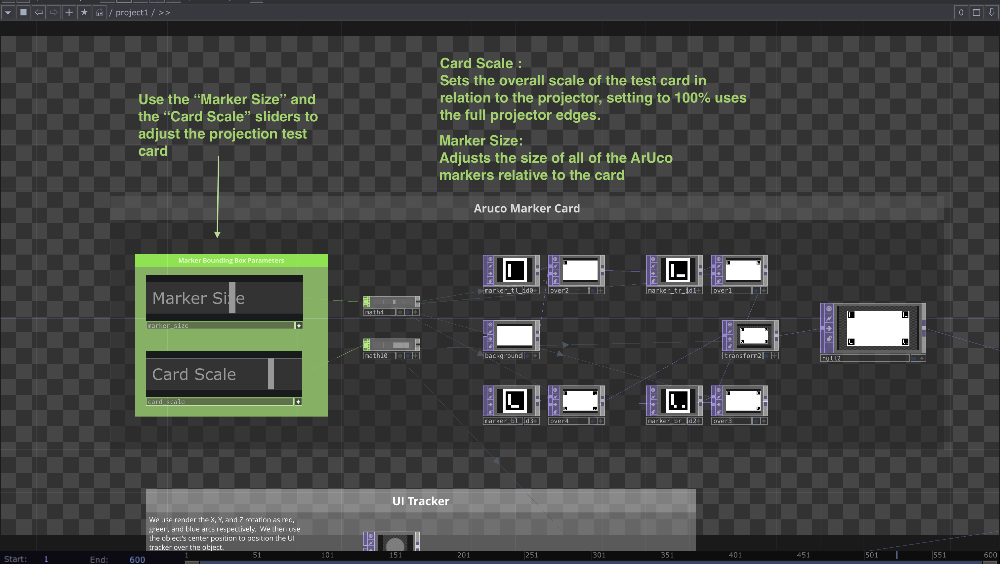
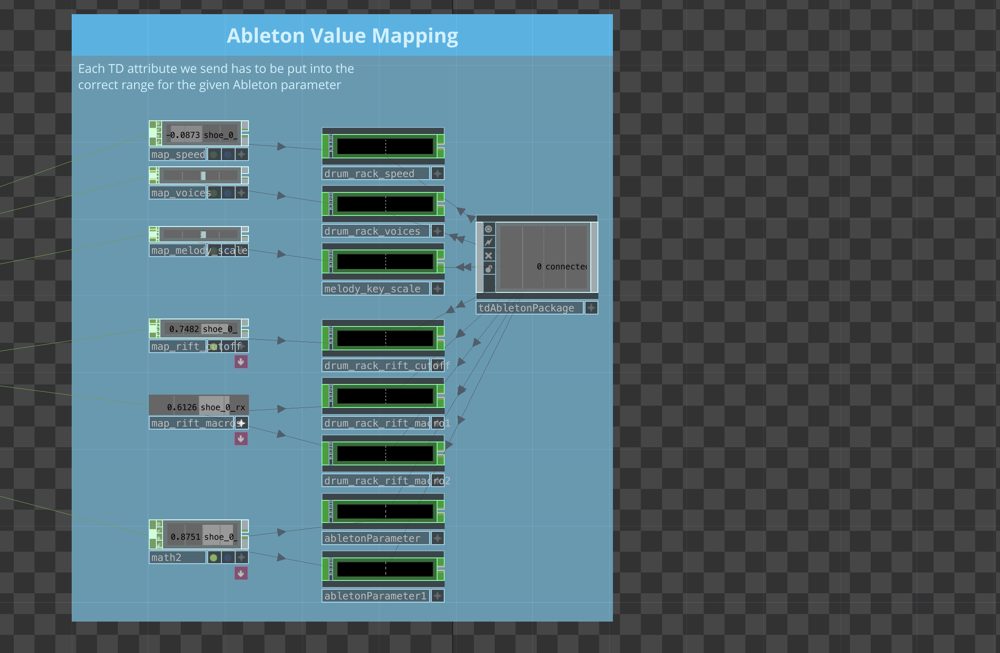

# TuneCraft

By Jose Conchello - DGMD E-14: Wearable Devices and Computer Vision - Fall 2023 Final Project

** Note ** This readme is meant as a guide to get the project up and running as well as to offer insight into the various ways and places where a user/developer would need to know to make updates to the project. For an in-depth explanation of the technical decisions made for this project please visit the full project report below in the [Project Overview](#project-description) section below.

Table of Contents (click to toggle)

1. [Project Overview](#project-description)

2. [Technologies Used](#technologies-used)
   - [Software and Plugins](#software-and-plugins)
   - [Frameworks and Libraries](#frameworks-and-libraries)
   - [Hardware Requirements](#hardware-requirements)

3. [Installation Guide](#installation-guide)
   - [Software and Plugin Installation](#software-and-plugin-installation)
   - [Frameworks and Libraries Setup](#frameworks-and-libraries-setup)

4. [Getting Started](#getting-started)
   - [Setting Up the Project Environment](#setting-up-the-project-environment)
   - [Projector and Webcam Setup Guide](#projector-and-webcam-setup-guide)

5. [Running TuneCraft](#running-tunecraft)
   - [Setting Up the Hardware in TouchDesigner](#setting-up-the-hardware-in-touchdesigner)
   - [Using TuneCraft for Music Control](#using-tunecraft-for-music-control)

## Project Description: 
TuneCraft is an immersive and interactive computer vision art project that leverages 6D object pose detection to control music parameters in Ableton Live. This project is developed as the final project for DGMD E-14. It focuses on dynamic audio control through 6D object tracking. Utilizing computer vision, the project aims to create an interactive audio control environment where users can manipulate audio outputs through physical object movement and positioning.

[Project Walkthrough and Demo Video](https://youtu.be/2n1Z5icfN-w)\
[Project Presentation](https://youtu.be/IWK0HBRLtzk)\
[Link to Detailed Project Report](https://docs.google.com/document/d/1nDZOWPT0zQLzOOU27f3uuQJEj4dGhFwn-rsLJNAcoKE/edit)

## Technologies Used:
  - ### Software and Plugins:
    - #### [TouchDesigner](http://touchdesigner.com/) (Free)
      - TouchDesigner is a visual programming language for creating interactive 2D and 3D applications. It's used by artists, programmers, and other creatives to make installations, performances, and other multimedia content.
    - #### [Ableton Live](https://www.ableton.com/) (Paid, but has a free Intro trial available)
      - Ableton Live is a digital audio workstation (DAW) that allows users to create, produce, and perform music. It's known for its loop-based composition and real-time performance.
    - #### [Rift](https://www.minimal.audio/products/rift) by Minimal Audio (Paid)
      - Rift is a unique distortion plugin with 30 custom algorithms spanning both classic and never-before-heard processors. These effects are blended in the waveform engine, giving you precise control over how the two algorithms are combined, plus clear visual feedback of the results.
    - #### [TDAbleton](https://docs.derivative.ca/TDAbleton) (Free)
      - TDAbleton is a tool that connects TouchDesigner and Ableton Live. It allows for full access and control of both programs. TDAbleton provides real-time data to and from Ableton. 
  - ### Frameworks and Libraries
    - #### Python
    - #### OpenCV
      - OpenCV (Open Source Computer Vision) is an open-source, cross-platform and free library that includes hundreds of computer vision algorithms. It has C++, Python, Java, MATLAB and more bindings. 
    - #### MediaPipe
      - MediaPipe is an open-source framework for building pipelines to perform computer vision inference over arbitrary sensory data such as video or audio.
    - #### Anaconda
      - Anaconda is a free, open-source distribution of the Python and R programming languages. It's designed for data science, machine learning, predictive analytics, and large-scale data processing. Anaconda aims to simplify package management and deployment. 
       
  - ### Hardware Requirements
    - Computer able to handle the requirements of the above software suites
    - Projector
    - Webcam (and potentially a webcam mount)
    - A shoe

## Installation Guide
- ### Software and Plugin Installation
    - TouchDesigner (Free): 
      -  Download and install the latest version of TouchDesigner for your OS from the [Derivative website](https://derivative.ca/download).
    - Ableton Live: (Paid, but has a free Intro trial available)
      - [Installation](https://help.ableton.com/hc/en-us/articles/209773565-Installing-Live)
    - Rift by Minimal Audio
      - [Product Download Page](https://www.minimal.audio/products/rift)
      - [VST Plugins on Window](https://help.ableton.com/hc/en-us/articles/209071729-Using-VST-plug-ins-on-Windows)
      - [VST Plugins on Mac](https://help.ableton.com/hc/en-us/articles/209068929-Using-AU-and-VST-plug-ins-on-Mac)
    - TDAbleton
      - https://derivative.ca/UserGuide/TDAbleton
      - [Installation Guide](https://docs.derivative.ca/TDAbleton#Install_the_latest_TDAbleton_system)
      - [Youtube Guide](https://www.youtube.com/watch?v=8fBo5oFZPck&pp=ygURdGRhYmxldG9uIGluc3RhbGw%3D)
  
- ### Frameworks and Libraries Setup
  - Anaconda
    - [Follow Download Page Instructions](https://www.anaconda.com/download)

## Getting Started:
  - Follow the instructions for installing the above software suites and frameworks.
  
  - #### Setting Up the Project Environment
    - Launch the Anaconda Prompt/Terminal 
    - From the Anaconda Prompt/Terminal change directories into the root of this directory (ie environment.yaml should be in this directory from where you run the following conda commands).
    - ##### Create Anaconda Environment:
      - `conda env create -f environment.yml`
        - This will install the necessary Python packages and dependencies required to run this project.
    -  ##### Activate Anaconda Environment 
       -  To activate a conda environment, you can use the command conda activate. You can also use conda deactivate to deactivate your current environment and switch to the default environment. 
       -  `conda activate td-cv`
    -  ##### Point Touchdesigner to the Anaconda environment to have access to the required Python libraries
       -  Open `./touchdesigner/env-setup.py`
       -  Update the environment paths.
       -  Using the regular Anaconda installation paths, you should only need to update the user variable in the onStart() method.
       -  You should verify that these paths in the onStart() method match where your instance of Anaconda is running environments.
  - #### Projector and Webcam Setup Guide
    - For best results, you will want to set up the projector as vertically as possible over the floor where the target object will be. The more overhead the projector is with over object/ground, the less the tracking will skew. The camera/sensor should match the projector's location and angle as best as possible.
    - The projector and the camera/sensor should both be plugged into the computer that will be running this project.
    - Below is a diagram of the ideal setup, though other configurations will also work.
    - You will need to have your computer using the projector as an extended display (instead of the default mirroring of displays) See your operating system's settings/preferences to extend displays.
    - 
    - 
  
## Running TuneCraft
- Open the Ableton Live file at `./ableton/generative-drums.als` file
- Open the Touchdesigner file at `./touchdesigner/tune-craft-cv.toe`
- ### Setting Up the Hardware in TouchDesigner
  - Below is a map/overview of the Touchdesigner patch highlighting the major segments of workflows
  - 
  - #### Selecting the webcam
    - Navigate to the Video Input section of the patch in green (refer to the map above)
    - Click on the `videodevicein1` node, its preferences panel will open up.
    - In the panel select your Camera from the "Device" dropdown menu. If you have no other cameras connected it should be the first one selected. If it is not you will have to find your camera first by selecting the correct library where your camera is and then selecting from those "Devices". ** See image below:
    - 
  - #### Selecting the output projector for UI projection 
    - Navigate to the projection output section of the patch (upper right corner of the map above)
    - Click on the `window1` node and its preferences panel will open up.
    - Select the index of the monitor to send the projection tracking output to. The list of available monitors and their index will be in a window above the projection output section ** see image below
    - 
    - Once you have extended your display to use the projector via system settings (ie. not mirrored) and have selected the monitor in the previous step. Click on the "Full Screen" button in green. ** see the image below.
    - 
    - Now you should briefly see a white screen with 4 ArUco markers, one in each corner, being projected.
    - Once all 4 markers have been detected then the UI feed will switch to projecting the spotlight over the detection object when found.
    - However, if the ArUco Markers do not adequately fit in the area that we are projecting on (ie. some are not seen or cut off), then we will need to adjust their size and or placement.
    - The spread and size of the ArUco Markers can be changed by navigating to the ArUco Test Card section in the upper left section of the patch ** see the image below
      - The Card Scale slider sets the overall scale of the test card to the projector, setting the scale to 100% of the full projection space.
      - The Marker Size slider adjusts the size of all of the ArUco markers relative to the full test card.
      - 
      - Adjust these settings until the ArUco detection script locates all 4 ArUco markers to activate the object detection/tracking portion.
      - Once the ArUco Marker test card is gone, the object detection UI will automatically start, and you can now start playing with a shoe.
  
  - #### Using TuneCraft for Music Control
    - Assuming that there were no problems in the previous steps, you should now be able to use TuneCraft as real-time music.
    - TuneCraft is set up to track a "Shoe" as the method to control the music parameters in Ableton Live.
    - The Ableton Value Mapping section of the Touchdesigner patch will update with the values that are being exported to Ableton.
    - 
    - Moving the shoe along the X and Y plane on the ground, within the projected boundary, will update the speed of the drums and the melodic scale of the synthesizer playing. Rotating the shoe along the X, Y, and Z will additionally control the parameters of the audio effects that are running on the drums and the synthesizer. 
    - As the Shoe is moved along the X and Y plane the projector will shine a spotlight on it and track it within the projection boundary.
    - As the shoe is rotated along the X, Y, and Z plane, three colored concentric arcs of red, green, and blue will update their position around the Shoe in real-time as visual feedback to demonstrate the Shoe's current angle.
